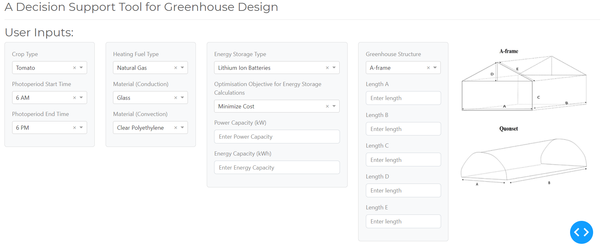

## A Decision Support Tool for Greenhouse Design
This project is created as a part of the 4th year capstone design course at the University of Toronto Engineering Science Energy Systems specialization. For more design background, process and assumptions of our simulation project, please see our online documentation (link to be updated). We hope you enjoy exploring our project!

## Getting Started
Our project runs on Python 3.7 and uses Plotly Dash and Dash Bootstrap Components packages. Therefore, in order to run our simulation, you will need to install Python and the associated packages. Please see the below links to the official documentation for set up instructions.  

Anaconda Python Package: https://www.anaconda.com/products/individual   
Plotly Dash: https://dash.plotly.com/installation  
Dash Bootstrap Components: https://dash-bootstrap-components.opensource.faculty.ai/  

In our design, Plotly Dash is used to make our simulation interactive to the users and Dash Bootstrap Components is used to organized our frontend layout neatly.

## How to run a simulation?
To run a simulation, simply clone this repository to your local workspace. Then run the file, layout.py. A new web browser should open and display the users inputs as the figure shown here.  

## Sample outputs
The figures below show the sample outputs from the simulation.

## How to modify datasets?
All of the data used to design this simulation is stored in the folder named datasets. If you would like to enhance or update the data, simply modified the excel workbooks or csvs there. However, you may also need to update the code base if you change the input parameters or change the format of the datasets completely.

## Major assumptions in our simulation
(To be updated)
